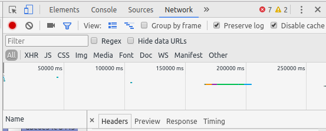
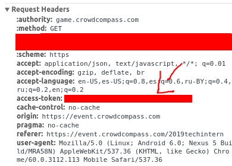

# RapidOnboarding
Automating the completion of CrowdCompass event achievements

## How To Use

```bash
$ python main.py
Access Token: MY_ACCESS_TOKEN
UUID: MY_UUID

{"score":16700,"awarded_achievements":[]}
{"score":16700,"awarded_achievements":[]}
{"score":16700,"awarded_achievements":[]}
```

## Generating Access Token & UUID

- Log into your CrowdCompass account through the link in your email

- Turn on the networking debugging tools in your browser (Ctrl + Shift + J)

<p align="center">

</p>


- Go to: https://event.crowdcompass.com/2019techintern/game/myprogress

- Go to the network request URL starting with: https://game.crowdcompass.com/games/E2HnUZ3rp1/players/

- Your UUID is the part of URL after "/players/" and before "?_release"

- Your Access-Token can be found under the "Request Headers" section for this same network request

<p align="center">

</p>
